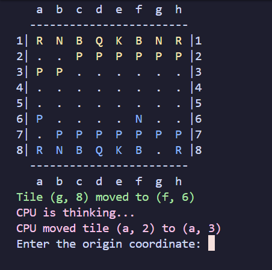

# PE_chess



## Features
- CPU (MinMax)
- Input management
- Console Chessboard


## How to run
#### CMake (Windows)
```bash
cmake -S . -B build
cmake --build build
./build/Debug/chess_engine.exe
```
